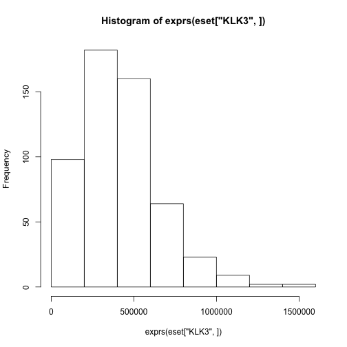
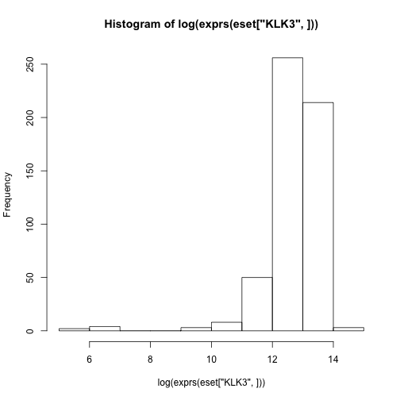
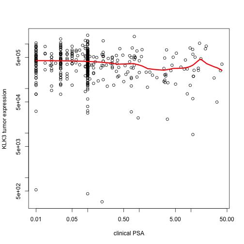
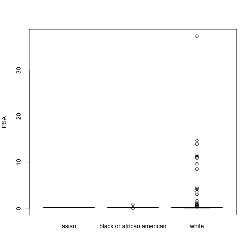

# Load TCGA data


```r
if(!require(RTCGAToolbox)){
  biocLite("devtools")
  biocLite(c("limma", "RCircos", "data.table", "RCurl", "RJSONIO"))
  biocLite("Link-NY/RTCGAToolbox")
}
```

```
## Warning: replacing previous import by 'IRanges::shift' when loading
## 'RTCGAToolbox'
```

```r
library(DESeq2)
```

# Download TCGA PRAD data


```r
library(RTCGAToolbox)
rundates <- getFirehoseRunningDates()
analysisdates <- getFirehoseAnalyzeDates()
prad <- getFirehoseData("PRAD", runDate=rundates[1],
                      gistic2_Date=analysisdates[1], RNAseq_Gene=TRUE, 
        miRNASeq_Gene=TRUE, RNAseq2_Gene_Norm=TRUE, CNA_SNP=TRUE,
        CNV_SNP=TRUE, CNA_Seq=TRUE, CNA_CGH=TRUE,  Methylation=TRUE,
        Mutation=TRUE, mRNA_Array=TRUE, miRNA_Array=TRUE, RPPA=TRUE)
```

```
## gdac.broadinstitute.org_PRAD.Clinical_Pick_Tier1.Level_4.2015040200.0.0.tar.gz
## Using locally cached version of ./20150402-PRAD-Clinical.txt
## 
## gdac.broadinstitute.org_PRAD.Merge_rnaseqv2__illuminahiseq_rnaseqv2__unc_edu__Level_3__RSEM_genes_normalized__data.Level_3.2015040200.0.0.tar.gz
## Using locally cached version of ./20150402-PRAD-RNAseq2GeneNorm.txt
## RNAseq2 data will be imported! This may take a while!
## Start: 2015-12-01 13:56:53
```

```
## 
Read 48.7% of 20533 rows
Read 97.4% of 20533 rows
Read 20533 rows and 551 (of 551) columns from 0.090 GB file in 00:00:06
```

```
## Done: 2015-12-01 13:56:59
## gdac.broadinstitute.org_PRAD.Merge_mirnaseq__illuminahiseq_mirnaseq__bcgsc_ca__Level_3__miR_gene_expression__data.Level_3.2015040200.0.0.tar.gz
## Using locally cached version of ./20150402-PRAD-miRNAseqGene.txt
## miRNAseq data will be imported! This may take a while!
## Start: 2015-12-01 13:57:16
## Done: 2015-12-01 13:57:16
## gdac.broadinstitute.org_PRAD.Merge_snp__genome_wide_snp_6__broad_mit_edu__Level_3__segmented_scna_hg19__seg.Level_3.2015040200.0.0.tar.gz
## Using locally cached version of ./20150402-PRAD-CNASNPHg19.txt
## gdac.broadinstitute.org_PRAD.Merge_snp__genome_wide_snp_6__broad_mit_edu__Level_3__segmented_scna_minus_germline_cnv_hg19__seg.Level_3.2015040200.0.0.tar.gz
## Using locally cached version of ./20150402-PRAD-CNVSNPHg19.txt
## gdac.broadinstitute.org_PRAD.Merge_cna__illuminahiseq_dnaseqc__hms_harvard_edu__Level_3__segmentation__seg.Level_3.2015040200.0.0.tar.gz
## Using locally cached version of ./20150402-PRAD-CNAseq.txt
## 
## gdac.broadinstitute.org_PRAD.Merge_methylation__humanmethylation450__jhu_usc_edu__Level_3__within_bioassay_data_set_function__data.Level_3.2015040200.0.0.tar.gz
## http://gdac.broadinstitute.org/runs/stddata__2015_04_02/data/PRAD/20150402/gdac.broadinstitute.org_PRAD.Merge_methylation__humanmethylation450__jhu_usc_edu__Level_3__within_bioassay_data_set_function__data.Level_3.2015040200.0.0.tar.gz
## File Size: ~2066MB
## File above won't be downloaded due to data size, RTCGAToolbox will skip this data!
## 
## 
## 
## 
## 
## gdac.broadinstitute.org_PRAD.Mutation_Packager_Calls.Level_3.2015040200.0.0.tar.gz
## gdac.broadinstitute.org_PRAD-TP.CopyNumber_Gistic2.Level_4.2014101700.0.0.tar.gz
```

# Extract available data types


```r
choices <- tolower(gsub("_", "", c("RNAseq_Gene", "miRNASeq_Gene",
             "RNAseq2_Gene_Norm", "CNA_SNP", "CNV_SNP", "CNA_Seq",
             "CNA_CGH", "Methylation", "Mutation", "mRNA_Array",
             "miRNA_Array", "RPPA")))
```


```r
dses <- lapply(choices, function(choice) try(extract(prad, choice, 
                                            clinic=TRUE),
                                             silent=TRUE))
names(dses) <- choices
dses
```

```
## $rnaseqgene
## [1] "Error in extract(prad, choice, clinic = TRUE) : \n  There is no data for that data type!\n"
## attr(,"class")
## [1] "try-error"
## attr(,"condition")
## <simpleError in extract(prad, choice, clinic = TRUE): There is no data for that data type!>
## 
## $mirnaseqgene
## ExpressionSet (storageMode: lockedEnvironment)
## assayData: 1046 features, 537 samples 
##   element names: exprs 
## protocolData: none
## phenoData
##   sampleNames: tcga-2a-a8vl-01 tcga-2a-a8vo-01 ... tcga-zg-a9ni-01
##     (537 total)
##   varLabels: vital_status days_to_death ... center (242 total)
##   varMetadata: labelDescription
## featureData: none
## experimentData: use 'experimentData(object)'
## Annotation:  
## 
## $rnaseq2genenorm
## ExpressionSet (storageMode: lockedEnvironment)
## assayData: 20501 features, 540 samples 
##   element names: exprs 
## protocolData: none
## phenoData
##   sampleNames: tcga-2a-a8vl-01 tcga-2a-a8vo-01 ... tcga-zg-a9ni-01
##     (540 total)
##   varLabels: vital_status days_to_death ... center (242 total)
##   varMetadata: labelDescription
## featureData: none
## experimentData: use 'experimentData(object)'
## Annotation:  
## 
## $cnasnp
## GRangesList object of length 1009:
## $tcga-2a-a8vl-01 
## GRanges object with 377 ranges and 2 metadata columns:
##         seqnames                ranges strand   | Num_Probes Segment_Mean
##            <Rle>             <IRanges>  <Rle>   |  <numeric>    <numeric>
##     [1]     chr1  [   61735, 16153497]      *   |       8417       0.0192
##     [2]     chr1  [16153536, 16155010]      *   |          9      -1.3997
##     [3]     chr1  [16165661, 25583291]      *   |       5733       0.0271
##     [4]     chr1  [25583341, 25646986]      *   |         29      -1.7924
##     [5]     chr1  [25661501, 35091594]      *   |       4967       0.0196
##     ...      ...                   ...    ... ...        ...          ...
##   [373]    chr22 [24401529,  51234455]      *   |      18918       0.0199
##   [374]    chr23 [  168477,  34044373]      *   |      21155       0.0011
##   [375]    chr23 [34046553,  34070287]      *   |         23      -3.3231
##   [376]    chr23 [34073425, 155182354]      *   |      62721       0.0039
##   [377]    chr24 [ 2650438,  59018259]      *   |       8631      -0.8552
## 
## ...
## <1008 more elements>
## -------
## seqinfo: 24 sequences from an unspecified genome; no seqlengths
## 
## $cnvsnp
## GRangesList object of length 1003:
## $tcga-2a-a8vl-01 
## GRanges object with 117 ranges and 2 metadata columns:
##         seqnames                ranges strand   | Num_Probes Segment_Mean
##            <Rle>             <IRanges>  <Rle>   |  <numeric>    <numeric>
##     [1]     chr1 [ 3218610,  46599744]      *   |      22807       0.0218
##     [2]     chr1 [46601887,  53641875]      *   |       3572      -0.3873
##     [3]     chr1 [53641911,  58304399]      *   |       3399       0.0166
##     [4]     chr1 [58314187,  58497759]      *   |        168        -0.37
##     [5]     chr1 [58498264, 104381295]      *   |      28166       0.0157
##     ...      ...                   ...    ... ...        ...          ...
##   [113]    chr21 [42827478,  42864812]      *   |        101      -0.8952
##   [114]    chr21 [42867190,  42872410]      *   |         26      -0.3935
##   [115]    chr21 [42875404,  47678774]      *   |       2367       0.0223
##   [116]    chr22 [17423930,  49331012]      *   |      16920        0.024
##   [117]    chr23 [ 3157107, 154905589]      *   |      63256       0.0041
## 
## ...
## <1002 more elements>
## -------
## seqinfo: 23 sequences from an unspecified genome; no seqlengths
## 
## $cnaseq
## GRangesList object of length 230:
## $tcga-ch-5741-01 
## GRanges object with 88 ranges and 2 metadata columns:
##        seqnames                 ranges strand   | Num_Probes
##           <Rle>              <IRanges>  <Rle>   |  <numeric>
##    [1]     chr1 [    10208, 170998749]      *   |       <NA>
##    [2]     chr1 [170998750, 171222653]      *   |       <NA>
##    [3]     chr1 [171222654, 249240606]      *   |       <NA>
##    [4]     chr2 [    10001, 243189359]      *   |       <NA>
##    [5]     chr3 [    60174,  70581515]      *   |       <NA>
##    ...      ...                    ...    ... ...        ...
##   [84]    chr23 [128529035, 128582748]      *   |       <NA>
##   [85]    chr23 [128582749, 154930285]      *   |       <NA>
##   [86]    chr24 [  2649474,   6711879]      *   |       <NA>
##   [87]    chr24 [  6711880,   6813216]      *   |       <NA>
##   [88]    chr24 [  6813217,  28809960]      *   |       <NA>
##              Segment_Mean
##                 <numeric>
##    [1] 0.0445519350183502
##    [2] -0.719244299367207
##    [3] 0.0416368338763181
##    [4] 0.0400665363289484
##    [5] 0.0357777450352256
##    ...                ...
##   [84]  -2.31507050198042
##   [85] 0.0277920429090032
##   [86] 0.0865462501641183
##   [87]  0.952415386548219
##   [88]  0.101459215941079
## 
## ...
## <229 more elements>
## -------
## seqinfo: 24 sequences from an unspecified genome; no seqlengths
## 
## $cnacgh
## [1] "Error in extract(prad, choice, clinic = TRUE) : \n  There is no data for that data type!\n"
## attr(,"class")
## [1] "try-error"
## attr(,"condition")
## <simpleError in extract(prad, choice, clinic = TRUE): There is no data for that data type!>
## 
## $methylation
## [1] "Error in extract(prad, choice, clinic = TRUE) : \n  There is no data for that data type!\n"
## attr(,"class")
## [1] "try-error"
## attr(,"condition")
## <simpleError in extract(prad, choice, clinic = TRUE): There is no data for that data type!>
## 
## $mutation
## GRangesList object of length 420:
## $tcga-2a-a8vl-01 
## GRanges object with 39 ranges and 0 metadata columns:
##        seqnames                 ranges strand
##           <Rle>              <IRanges>  <Rle>
##    [1]    chr10 [ 29775061,  29775061]      +
##    [2]     chr2 [ 30480447,  30480447]      +
##    [3]     chr8 [ 39495171,  39495171]      +
##    [4]     chr1 [158262073, 158262073]      +
##    [5]     chr8 [ 41519413,  41519413]      +
##    ...      ...                    ...    ...
##   [35]     chr3 [138739004, 138739004]      +
##   [36]    chr20 [ 33440316,  33440316]      +
##   [37]    chr20 [ 33324502,  33324502]      +
##   [38]     chr3 [195713385, 195713386]      +
##   [39]     chr5 [180708776, 180708777]      +
## 
## ...
## <419 more elements>
## -------
## seqinfo: 25 sequences from an unspecified genome; no seqlengths
## 
## $mrnaarray
## [1] "Error in extract(prad, choice, clinic = TRUE) : \n  There is no data for that data type!\n"
## attr(,"class")
## [1] "try-error"
## attr(,"condition")
## <simpleError in extract(prad, choice, clinic = TRUE): There is no data for that data type!>
## 
## $mirnaarray
## [1] "Error in extract(prad, choice, clinic = TRUE) : \n  There is no data for that data type!\n"
## attr(,"class")
## [1] "try-error"
## attr(,"condition")
## <simpleError in extract(prad, choice, clinic = TRUE): There is no data for that data type!>
## 
## $rppa
## [1] "Error in extract(prad, choice, clinic = TRUE) : \n  There is no data for that data type!\n"
## attr(,"class")
## [1] "try-error"
## attr(,"condition")
## <simpleError in extract(prad, choice, clinic = TRUE): There is no data for that data type!>
```


```r
eset <- extract(prad, "rnaseq2genenorm")
write.csv(exprs(eset), file="prad_rnaseq.csv")
write.csv(pData(eset), file="prad_clinical.csv")
saveRDS(eset, file="prad_eset.rds")
```

To load the eset again:


```r
eset <- readRDS("prad_eset.rds")
```

# Make a histogram of PSA (KLK3) expression


```r
hist(exprs(eset["KLK3", ]))
```

 

```r
hist(log(exprs(eset["KLK3", ])))
```

 

# See what clinical data are available by default:


```r
summary(pData(eset))
```

```
##  vital_status       days_to_death      days_to_last_followup
##  Length:540         Length:540         Length:540           
##  Class :character   Class :character   Class :character     
##  Mode  :character   Mode  :character   Mode  :character     
##                                                             
##                                                             
##                                                             
##                                                             
##  primary_site_of_disease neoplasm_diseasestage pathology_T_stage 
##  Length:540              Length:540            Length:540        
##  Class :character        Class :character      Class :character  
##  Mode  :character        Mode  :character      Mode  :character  
##                                                                  
##                                                                  
##                                                                  
##                                                                  
##  pathology_N_stage  dcc_upload_date       gender         
##  Length:540         Length:540         Length:540        
##  Class :character   Class :character   Class :character  
##  Mode  :character   Mode  :character   Mode  :character  
##                                                          
##                                                          
##                                                          
##                                                          
##  date_of_initial_pathologic_diagnosis radiation_therapy 
##  Length:540                           Length:540        
##  Class :character                     Class :character  
##  Mode  :character                     Mode  :character  
##                                                         
##                                                         
##                                                         
##                                                         
##  histological_type  radiations_radiation_regimenindication
##  Length:540         Length:540                            
##  Class :character   Class :character                      
##  Mode  :character   Mode  :character                      
##                                                           
##                                                           
##                                                           
##                                                           
##  completeness_of_resection number_of_lymph_nodes gleason_score_combined
##  Length:540                Length:540            Length:540            
##  Class :character          Class :character      Class :character      
##  Mode  :character          Mode  :character      Mode  :character      
##                                                                        
##                                                                        
##                                                                        
##                                                                        
##  gleason_score_primary gleason_score_secondary gleason_score     
##  Length:540            Length:540              Length:540        
##  Class :character      Class :character        Class :character  
##  Mode  :character      Mode  :character        Mode  :character  
##                                                                  
##                                                                  
##                                                                  
##                                                                  
##  psa_result_preop   days_to_preop_psa   psa_value        
##  Length:540         Length:540         Length:540        
##  Class :character   Class :character   Class :character  
##  Mode  :character   Mode  :character   Mode  :character  
##                                                          
##                                                          
##                                                          
##                                                          
##  days_to_psa            race            ethnicity        
##  Length:540         Length:540         Length:540        
##  Class :character   Class :character   Class :character  
##  Mode  :character   Mode  :character   Mode  :character  
##                                                          
##                                                          
##                                                          
##                                                          
##  batch_number       admin.batch_number
##  Length:540         184.61.0: 78      
##  Class :character   429.22.0: 68      
##  Mode  :character   91.57.0 : 68      
##                     389.30.0: 45      
##                     370.32.0: 42      
##                     357.34.0: 30      
##                     (Other) :209      
##                           admin.bcr   admin.day_of_dcc_upload
##  nationwide children's hospital:540   12:  4                 
##                                       26:534                 
##                                       29:  2                 
##                                                              
##                                                              
##                                                              
##                                                              
##                              admin.file_uuid admin.month_of_dcc_upload
##  016de7f0-1048-4add-ba29-85ba6a4dc4f7:  2    1:  2                    
##  060644b7-7ff0-481a-9f83-fc23dc16df91:  2    2:  2                    
##  076d02bb-3504-4139-91b7-5d52883cb39a:  2    3:536                    
##  09cc76ff-9742-4af8-8c0f-2998a5561dfc:  2                             
##  0ad65f96-3ab3-491e-8a17-1844474e3886:  2                             
##  0bb87419-ce94-4a3a-94b9-ca797cca10b7:  2                             
##  (Other)                             :528                             
##  patient.additional_studies patient.age_at_initial_pathologic_diagnosis
##  NA's:540                   66     : 36                                
##                             61     : 32                                
##                             64     : 31                                
##                             57     : 30                                
##                             63     : 29                                
##                             62     : 27                                
##                             (Other):355                                
##                          patient.bcr_patient_uuid
##  00e41e6a-9fe7-44f9-978b-7b05b179506a:  2        
##  0730216b-c201-443c-9092-81e23fd13c6c:  2        
##  07ccb4e9-a2a9-4bfd-97bd-13873b01977a:  2        
##  1426b4bf-f4a5-477c-bbbb-e0e656549764:  2        
##  181c6d37-9d8d-4ffa-827b-e3785450ff88:  2        
##  1d7ffbe7-6139-412b-8739-8082a63a2b33:  2        
##  (Other)                             :528        
##  patient.biochemical_recurrence
##  no  :402                      
##  yes : 61                      
##  NA's: 77                      
##                                
##                                
##                                
##                                
##                                  patient.bone_scan_results
##  abnormal (not related to prostate cancer)    : 23        
##  equivocal                                    :  9        
##  normal (no evidence of prostate cancer) [cm0]:231        
##  NA's                                         :277        
##                                                           
##                                                           
##                                                           
##  patient.clinical_cqcf.country patient.clinical_cqcf.days_to_consent
##  united states:441             31     : 14                          
##  germany      : 59             62     : 13                          
##  canada       : 27             42     : 12                          
##  australia    :  8             0      : 10                          
##  moldova      :  1             63     : 10                          
##  romania      :  1             (Other):451                          
##  (Other)      :  3             NA's   : 30                          
##  patient.clinical_cqcf.days_to_preop_psa
##  0      : 71                            
##  -33    :  8                            
##  -22    :  7                            
##  31     :  7                            
##  -18    :  6                            
##  (Other):403                            
##  NA's   : 38                            
##        patient.clinical_cqcf.ethnicity
##  hispanic or latino    :  5           
##  not hispanic or latino:424           
##  NA's                  :111           
##                                       
##                                       
##                                       
##                                       
##  patient.clinical_cqcf.gleason_score_combined
##  08:  1                                      
##  10: 11                                      
##  6 : 55                                      
##  7 :284                                      
##  8 : 75                                      
##  9 :114                                      
##                                              
##  patient.clinical_cqcf.gleason_score_primary
##  05:  1                                     
##  2 :  2                                     
##  3 :235                                     
##  4 :241                                     
##  5 : 61                                     
##                                             
##                                             
##  patient.clinical_cqcf.gleason_score_secondary
##  03:  1                                       
##  3 :167                                       
##  4 :285                                       
##  5 : 87                                       
##                                               
##                                               
##                                               
##                    patient.clinical_cqcf.histological_type
##  prostate adenocarcinoma  other subtype: 16               
##  prostate adenocarcinoma acinar type   :524               
##                                                           
##                                                           
##                                                           
##                                                           
##                                                           
##                                patient.clinical_cqcf.history_of_prior_malignancy
##  no                                                     :509                    
##  yes, history of prior malignancy                       : 28                    
##  yes, history of synchronous and or bilateral malignancy:  3                    
##                                                                                 
##                                                                                 
##                                                                                 
##                                                                                 
##  patient.clinical_cqcf.normal_tissue_anatomic_site
##  other          :170                              
##  seminal vesicle: 58                              
##  NA's           :312                              
##                                                   
##                                                   
##                                                   
##                                                   
##  patient.clinical_cqcf.normal_tissue_proximity
##  adjacent (< or = 2cm): 12                    
##  distal (>2cm)        :208                    
##  NA's                 :320                    
##                                               
##                                               
##                                               
##                                               
##  patient.clinical_cqcf.other_anatomic_site_normal_tissue
##  blood   :  5                                           
##  prostate:115                                           
##  NA's    :420                                           
##                                                         
##                                                         
##                                                         
##                                                         
##  patient.clinical_cqcf.psa_result_preop
##  4.6    : 14                           
##  5.2    : 12                           
##  5.6    : 11                           
##  5.5    : 10                           
##  7.4    : 10                           
##  (Other):480                           
##  NA's   :  3                           
##                     patient.clinical_cqcf.race
##  american indian or alaska native:  1         
##  asian                           : 12         
##  black or african american       : 64         
##  white                           :444         
##  NA's                            : 19         
##                                               
##                                               
##  patient.day_of_form_completion patient.days_to_birth
##  16     : 45                    -20805 :  4          
##  20     : 31                    -23725 :  4          
##  5      : 29                    -23360 :  3          
##  28     : 28                    -23458 :  3          
##  6      : 28                    -15884 :  2          
##  23     : 27                    (Other):513          
##  (Other):352                    NA's   : 11          
##  patient.days_to_bone_scan_performed patient.days_to_death
##  31     : 11                         1329   :  1          
##  10     : 10                         1855   :  1          
##  12     : 10                         3467   :  1          
##  13     : 10                         628    :  1          
##  14     :  9                         728    :  1          
##  (Other):208                         (Other):  2          
##  NA's   :282                         NA's   :533          
##  patient.days_to_diagnostic_computed_tomography_performed
##  11     : 12                                             
##  31     : 12                                             
##  14     : 11                                             
##  10     :  8                                             
##  30     :  8                                             
##  (Other):167                                             
##  NA's   :322                                             
##  patient.days_to_diagnostic_mri_performed
##  0      :  3                             
##  43     :  3                             
##  45     :  3                             
##  -73    :  2                             
##  -8     :  2                             
##  (Other): 69                             
##  NA's   :458                             
##  patient.days_to_first_biochemical_recurrence
##  189    :  3                                 
##  124    :  2                                 
##  131    :  2                                 
##  81     :  2                                 
##  1009   :  1                                 
##  (Other): 62                                 
##  NA's   :468                                 
##  patient.days_to_initial_pathologic_diagnosis
##  0   :510                                    
##  NA's: 30                                    
##                                              
##                                              
##                                              
##                                              
##                                              
##  patient.days_to_last_followup patient.diagnostic_ct_abd_pelvis_performed
##  62     :  6                   no  :205                                  
##  91     :  6                   yes :220                                  
##  31     :  5                   NA's:115                                  
##  822    :  5                                                             
##  285    :  4                                                             
##  (Other):507                                                             
##  NA's   :  7                                                             
##                           patient.diagnostic_ct_abd_pelvis_results.diagnostic_ct_abd_pelvis_result
##  equivocal                                                    :  5                                
##  extraprostatic extension  localized (e.g. seminal vesicles)  :  5                                
##  extraprostatic extension (regional lymphadenopathy)[e.g. cn1]:  6                                
##  no evidence of extraprostatic extension                      :202                                
##  NA's                                                         :322                                
##                                                                                                   
##                                                                                                   
##  patient.diagnostic_mri_performed
##  no  :332                        
##  yes : 85                        
##  NA's:123                        
##                                  
##                                  
##                                  
##                                  
##                                  patient.diagnostic_mri_results.diagnostic_mri_result
##  equivocal                                                 :  5                      
##  extraprostatic extension localized (e.g. seminal vesicles): 23                      
##  no evidence of extraprostatic extension                   : 53                      
##  NA's                                                      :459                      
##                                                                                      
##                                                                                      
##                                                                                      
##                                     patient.diagnostic_mri_results.diagnostic_mri_result-2
##  equivocal                                                     :  1                       
##  extraprostatic extension (regional lymphadenopathy) [e.g. cn1]:  3                       
##  NA's                                                          :536                       
##                                                                                           
##                                                                                           
##                                                                                           
##                                                                                           
##  patient.drugs.drug-2.bcr_drug_barcode
##  tcga-ch-5751-d37730:  1              
##  tcga-ch-5788-d37734:  1              
##  tcga-g9-7521-d48748:  1              
##  tcga-g9-a9s0-d60766:  1              
##  tcga-hi-7171-d29022:  1              
##  (Other)            : 27              
##  NA's               :508              
##                     patient.drugs.drug-2.bcr_drug_uuid
##  03320f22-90b1-4353-ac00-be36880265e5:  1             
##  06103a93-83eb-418a-9522-2ff6efb7c941:  1             
##  0af1ea65-d032-4370-8744-f0016808415b:  1             
##  13e4a7e5-1c0b-4702-95a8-801835da59e4:  1             
##  187f4262-f427-4804-994f-8b01714a052a:  1             
##  (Other)                             : 27             
##  NA's                                :508             
##  patient.drugs.drug-2.clinical_trail_drug_classification
##  n/a :  2                                               
##  NA's:538                                               
##                                                         
##                                                         
##                                                         
##                                                         
##                                                         
##  patient.drugs.drug-2.day_of_form_completion
##  13     :  7                                
##  25     :  5                                
##  27     :  3                                
##  2      :  2                                
##  20     :  2                                
##  (Other): 13                                
##  NA's   :508                                
##  patient.drugs.drug-2.days_to_drug_therapy_end
##  1036   :  1                                  
##  1228   :  1                                  
##  126    :  1                                  
##  1461   :  1                                  
##  1527   :  1                                  
##  (Other): 12                                  
##  NA's   :523                                  
##  patient.drugs.drug-2.days_to_drug_therapy_start
##  207    :  2                                    
##  1078   :  1                                    
##  115    :  1                                    
##  1163   :  1                                    
##  1219   :  1                                    
##  (Other): 25                                    
##  NA's   :509                                    
##  patient.drugs.drug-2.drug_name
##  lupron    :  9                
##  casodex   :  6                
##  zoladex   :  4                
##  eligard   :  2                
##  leuprolide:  2                
##  (Other)   :  9                
##  NA's      :508                
##          patient.drugs.drug-2.measure_of_response
##  clinical progressive disease:  2                
##  complete response           : 11                
##  partial response            :  3                
##  stable disease              :  2                
##  NA's                        :522                
##                                                  
##                                                  
##  patient.drugs.drug-2.month_of_form_completion
##  4      :  9                                  
##  3      :  5                                  
##  12     :  4                                  
##  8      :  4                                  
##  10     :  2                                  
##  (Other):  8                                  
##  NA's   :508                                  
##  patient.drugs.drug-2.regimen_indication
##  recurrence:  1                         
##  NA's      :539                         
##                                         
##                                         
##                                         
##                                         
##                                         
##  patient.drugs.drug-2.therapy_ongoing
##  no  : 18                            
##  yes : 14                            
##  NA's:508                            
##                                      
##                                      
##                                      
##                                      
##  patient.drugs.drug-2.therapy_types.therapy_type
##  hormone therapy: 32                            
##  NA's           :508                            
##                                                 
##                                                 
##                                                 
##                                                 
##                                                 
##  patient.drugs.drug-2.tx_on_clinical_trial
##  no  : 27                                 
##  yes :  4                                 
##  NA's:509                                 
##                                           
##                                           
##                                           
##                                           
##  patient.drugs.drug-2.year_of_form_completion
##  2012:  3                                    
##  2013:  1                                    
##  2014: 27                                    
##  2015:  1                                    
##  NA's:508                                    
##                                              
##                                              
##  patient.drugs.drug-3.bcr_drug_barcode
##  tcga-ch-5751-d37731:  1              
##  tcga-g9-7521-d48749:  1              
##  tcga-g9-a9s0-d60767:  1              
##  tcga-hi-7171-d29023:  1              
##  tcga-kk-a6e0-d62512:  1              
##  (Other)            :  7              
##  NA's               :528              
##                     patient.drugs.drug-3.bcr_drug_uuid
##  03feb539-c786-41e6-9134-3c83d062c466:  1             
##  057173bd-c7f4-4750-882a-b9b51145c98a:  1             
##  1572b2f1-99f4-4b83-b2e3-67c95c87a27e:  1             
##  47e9f8b2-f44d-49a1-aced-7b3ce938ad99:  1             
##  4a16143e-2d4f-4674-971c-3e045626f7aa:  1             
##  (Other)                             :  7             
##  NA's                                :528             
##  patient.drugs.drug-3.clinical_trail_drug_classification
##  n/a :  1                                               
##  NA's:539                                               
##                                                         
##                                                         
##                                                         
##                                                         
##                                                         
##  patient.drugs.drug-3.day_of_form_completion
##  13     :  1                                
##  16     :  1                                
##  18     :  1                                
##  2      :  1                                
##  20     :  1                                
##  (Other):  7                                
##  NA's   :528                                
##  patient.drugs.drug-3.days_to_drug_therapy_end
##  1339   :  1                                  
##  1630   :  1                                  
##  2170   :  1                                  
##  3467   :  1                                  
##  605    :  1                                  
##  (Other):  2                                  
##  NA's   :533                                  
##  patient.drugs.drug-3.days_to_drug_therapy_start
##  1183   :  1                                    
##  1287   :  1                                    
##  1600   :  1                                    
##  1897   :  1                                    
##  2431   :  1                                    
##  (Other):  6                                    
##  NA's   :529                                    
##  patient.drugs.drug-3.drug_name
##  casodex        :  4           
##  degarelix      :  1           
##  lupron         :  5           
##  taxotere       :  1           
##  zoledronic acid:  1           
##  NA's           :528           
##                                
##          patient.drugs.drug-3.measure_of_response
##  clinical progressive disease:  3                
##  complete response           :  1                
##  partial response            :  2                
##  NA's                        :534                
##                                                  
##                                                  
##                                                  
##  patient.drugs.drug-3.month_of_form_completion
##  4      :  2                                  
##  7      :  2                                  
##  8      :  2                                  
##  11     :  1                                  
##  12     :  1                                  
##  (Other):  4                                  
##  NA's   :528                                  
##  patient.drugs.drug-3.therapy_ongoing
##  no  :  8                            
##  yes :  4                            
##  NA's:528                            
##                                      
##                                      
##                                      
##                                      
##  patient.drugs.drug-3.therapy_types.therapy_type
##  ancillary      :  1                            
##  chemotherapy   :  1                            
##  hormone therapy: 10                            
##  NA's           :528                            
##                                                 
##                                                 
##                                                 
##  patient.drugs.drug-3.tx_on_clinical_trial
##  no  : 11                                 
##  NA's:529                                 
##                                           
##                                           
##                                           
##                                           
##                                           
##  patient.drugs.drug-3.year_of_form_completion
##  2012:  2                                    
##  2013:  1                                    
##  2014:  9                                    
##  NA's:528                                    
##                                              
##                                              
##                                              
##  patient.drugs.drug-4.bcr_drug_barcode
##  tcga-g9-a9s0-d60768:  1              
##  tcga-hi-7171-d29024:  1              
##  tcga-kk-a8ii-d62413:  1              
##  tcga-yl-a8sb-d67267:  1              
##  tcga-yl-a8sp-d59011:  1              
##  tcga-yl-a9wk-d58528:  1              
##  NA's               :534              
##                     patient.drugs.drug-4.bcr_drug_uuid
##  17d96cc4-b3a0-46c2-af8a-5454ad7e54af:  1             
##  3780b9f2-c2ca-4db2-a58e-6f6fa6a66a55:  1             
##  4e9d83b0-0e1a-4de9-8edc-6777986d8f98:  1             
##  4f7e50a0-c217-4635-a1e3-677d4b516094:  1             
##  5c3ec5b6-18d2-46be-9fd9-3703a2fa6fbb:  1             
##  770b5c2b-e349-463b-a7d8-ab2d0ee929fc:  1             
##  NA's                                :534             
##  patient.drugs.drug-4.day_of_form_completion
##  13  :  1                                   
##  16  :  1                                   
##  22  :  1                                   
##  25  :  1                                   
##  3   :  1                                   
##  30  :  1                                   
##  NA's:534                                   
##  patient.drugs.drug-4.days_to_drug_therapy_end
##  2170:  1                                     
##  2738:  1                                     
##  727 :  1                                     
##  NA's:537                                     
##                                               
##                                               
##                                               
##  patient.drugs.drug-4.days_to_drug_therapy_start
##  1609:  1                                       
##  1814:  1                                       
##  1891:  1                                       
##  2516:  1                                       
##  559 :  1                                       
##  727 :  1                                       
##  NA's:534                                       
##  patient.drugs.drug-4.drug_name
##  cabazitaxel:  1               
##  casodex    :  3               
##  docetaxel  :  1               
##  lupron     :  1               
##  NA's       :534               
##                                
##                                
##          patient.drugs.drug-4.measure_of_response
##  clinical progressive disease:  2                
##  partial response            :  1                
##  NA's                        :537                
##                                                  
##                                                  
##                                                  
##                                                  
##  patient.drugs.drug-4.month_of_form_completion
##  11  :  1                                     
##  2   :  1                                     
##  4   :  2                                     
##  6   :  1                                     
##  8   :  1                                     
##  NA's:534                                     
##                                               
##  patient.drugs.drug-4.therapy_ongoing
##  no  :  4                            
##  yes :  2                            
##  NA's:534                            
##                                      
##                                      
##                                      
##                                      
##  patient.drugs.drug-4.therapy_types.therapy_type
##  chemotherapy   :  2                            
##  hormone therapy:  4                            
##  NA's           :534                            
##                                                 
##                                                 
##                                                 
##                                                 
##  patient.drugs.drug-4.tx_on_clinical_trial
##  no  :  5                                 
##  NA's:535                                 
##                                           
##                                           
##                                           
##                                           
##                                           
##  patient.drugs.drug-4.year_of_form_completion
##  2012:  1                                    
##  2014:  5                                    
##  NA's:534                                    
##                                              
##                                              
##                                              
##                                              
##  patient.drugs.drug-5.bcr_drug_barcode
##  tcga-kk-a8ii-d62416:  1              
##  NA's               :539              
##                                       
##                                       
##                                       
##                                       
##                                       
##   patient.drugs.drug.bcr_drug_barcode
##  tcga-v1-a9o5-d70126:  2             
##  tcga-4l-aa1f-d67927:  1             
##  tcga-ch-5741-d37729:  1             
##  tcga-ch-5751-d37727:  1             
##  tcga-ch-5752-d37732:  1             
##  (Other)            : 60             
##  NA's               :474             
##                      patient.drugs.drug.bcr_drug_uuid
##  cf129345-f428-483b-bf72-c431f6bba535:  2            
##  00ca7115-7773-4773-9ac4-ffccd1ccf33b:  1            
##  0f689e8f-3720-4bb6-9b8d-3fd7bf4a4164:  1            
##  1383f0a9-3896-485b-8575-e3412a373b34:  1            
##  1855423a-82d5-40a1-8789-9cb1346acf7d:  1            
##  (Other)                             : 60            
##  NA's                                :474            
##  patient.drugs.drug.clinical_trail_drug_classification
##  hormonal treatment:  1                               
##  n/a               :  4                               
##  NA's              :535                               
##                                                       
##                                                       
##                                                       
##                                                       
##  patient.drugs.drug.day_of_form_completion
##  25     : 10                              
##  13     :  8                              
##  27     :  7                              
##  10     :  4                              
##  20     :  4                              
##  (Other): 33                              
##  NA's   :474                              
##  patient.drugs.drug.days_to_drug_therapy_end
##  1106   :  1                                
##  143    :  1                                
##  1455   :  1                                
##  162    :  1                                
##  1862   :  1                                
##  (Other): 21                                
##  NA's   :514                                
##  patient.drugs.drug.days_to_drug_therapy_start
##  151    :  4                                  
##  118    :  3                                  
##  179    :  2                                  
##  207    :  2                                  
##  209    :  2                                  
##  (Other): 53                                  
##  NA's   :474                                  
##  patient.drugs.drug.drug_name
##  lupron    : 16              
##  casodex   : 14              
##  eligard   :  6              
##  leuprolide:  4              
##  zoladex   :  4              
##  (Other)   : 21              
##  NA's      :475              
##           patient.drugs.drug.measure_of_response
##  clinical progressive disease:  2               
##  complete response           : 19               
##  partial response            :  2               
##  stable disease              :  1               
##  NA's                        :516               
##                                                 
##                                                 
##  patient.drugs.drug.month_of_form_completion
##  8      : 12                                
##  4      : 11                                
##  3      :  9                                
##  1      :  8                                
##  12     :  6                                
##  (Other): 20                                
##  NA's   :474                                
##  patient.drugs.drug.number_cycles patient.drugs.drug.prescribed_dose
##  13  :  1                         22.5:  1                          
##  NA's:539                         400 :  1                          
##                                   NA's:538                          
##                                                                     
##                                                                     
##                                                                     
##                                                                     
##  patient.drugs.drug.prescribed_dose_units
##  mg  :  2                                
##  NA's:538                                
##                                          
##                                          
##                                          
##                                          
##                                          
##  patient.drugs.drug.therapy_ongoing
##  no  : 26                          
##  yes : 39                          
##  NA's:475                          
##                                    
##                                    
##                                    
##                                    
##  patient.drugs.drug.therapy_types.therapy_type
##  chemotherapy   :  3                          
##  hormone therapy: 63                          
##  NA's           :474                          
##                                               
##                                               
##                                               
##                                               
##  patient.drugs.drug.tx_on_clinical_trial
##  no  : 58                               
##  yes :  6                               
##  NA's:476                               
##                                         
##                                         
##                                         
##                                         
##  patient.drugs.drug.year_of_form_completion              patient.ethnicity
##  2012:  7                                   not hispanic or latino:197    
##  2013:  4                                   NA's                  :343    
##  2014: 48                                                                 
##  2015:  7                                                                 
##  NA's:474                                                                 
##                                                                           
##                                                                           
##  patient.follow_ups.follow_up-2.additional_pharmaceutical_therapy
##  no  :  4                                                        
##  yes :  1                                                        
##  NA's:535                                                        
##                                                                  
##                                                                  
##                                                                  
##                                                                  
##  patient.follow_ups.follow_up-2.bcr_followup_barcode
##  tcga-ej-7781-f60365:  2                            
##  tcga-ej-7782-f60366:  2                            
##  tcga-ej-7783-f60370:  2                            
##  tcga-ej-7784-f60372:  2                            
##  tcga-ej-7793-f60362:  2                            
##  (Other)            : 26                            
##  NA's               :504                            
##              patient.follow_ups.follow_up-2.bcr_followup_uuid
##  0a531879-7216-4649-9d57-18ce9d6de7e4:  2                    
##  2fe6895e-1d5b-453a-b8ca-c51311f587d2:  2                    
##  45f62940-8821-43ac-bc5b-268a9ba14895:  2                    
##  601cf690-ca85-4f26-ae09-9ac8daba8d86:  2                    
##  84754d49-164b-4e0c-bb40-690d1f151cb3:  2                    
##  (Other)                             : 26                    
##  NA's                                :504                    
##  patient.follow_ups.follow_up-2.day_of_form_completion
##  6      : 19                                          
##  11     :  4                                          
##  5      :  4                                          
##  30     :  3                                          
##  20     :  2                                          
##  (Other):  4                                          
##  NA's   :504                                          
##  patient.follow_ups.follow_up-2.days_to_first_biochemical_recurrence
##  1443:  2                                                           
##  NA's:538                                                           
##                                                                     
##                                                                     
##                                                                     
##                                                                     
##                                                                     
##  patient.follow_ups.follow_up-2.days_to_last_followup
##  1167   :  2                                         
##  1378   :  2                                         
##  1443   :  2                                         
##  2465   :  2                                         
##  606    :  2                                         
##  (Other): 23                                         
##  NA's   :507                                         
##  patient.follow_ups.follow_up-2.days_to_new_tumor_event_after_initial_treatment
##  1285:  1                                                                      
##  425 :  1                                                                      
##  974 :  1                                                                      
##  NA's:537                                                                      
##                                                                                
##                                                                                
##                                                                                
##  patient.follow_ups.follow_up-2.followup_case_report_form_submission_reason
##  additional new tumor event    :  2                                        
##  scheduled follow-up submission: 34                                        
##  NA's                          :504                                        
##                                                                            
##                                                                            
##                                                                            
##                                                                            
##  patient.follow_ups.follow_up-2.followup_treatment_success
##  complete remission/response: 32                          
##  progressive disease        :  4                          
##  NA's                       :504                          
##                                                           
##                                                           
##                                                           
##                                                           
##  patient.follow_ups.follow_up-2.lost_follow_up
##  no  : 30                                     
##  yes :  4                                     
##  NA's:506                                     
##                                               
##                                               
##                                               
##                                               
##  patient.follow_ups.follow_up-2.month_of_form_completion
##  10  :  2                                               
##  2   :  2                                               
##  3   :  1                                               
##  4   :  3                                               
##  5   :  1                                               
##  6   : 27                                               
##  NA's:504                                               
##      patient.follow_ups.follow_up-2.new_neoplasm_event_type
##  biochemical evidence of disease:  2                       
##  new primary tumor              :  3                       
##  NA's                           :535                       
##                                                            
##                                                            
##                                                            
##                                                            
##  patient.follow_ups.follow_up-2.new_tumor_event_after_initial_treatment
##  no  : 27                                                              
##  yes :  5                                                              
##  NA's:508                                                              
##                                                                        
##                                                                        
##                                                                        
##                                                                        
##  patient.follow_ups.follow_up-2.person_neoplasm_cancer_status
##  tumor free: 29                                              
##  with tumor:  3                                              
##  NA's      :508                                              
##                                                              
##                                                              
##                                                              
##                                                              
##  patient.follow_ups.follow_up-2.primary_therapy_outcome_success
##  complete remission/response: 27                               
##  progressive disease        :  2                               
##  NA's                       :511                               
##                                                                
##                                                                
##                                                                
##                                                                
##  patient.follow_ups.follow_up-2.radiation_therapy
##  no  : 29                                        
##  NA's:511                                        
##                                                  
##                                                  
##                                                  
##                                                  
##                                                  
##  patient.follow_ups.follow_up-2.vital_status
##  alive: 32                                  
##  NA's :508                                  
##                                             
##                                             
##                                             
##                                             
##                                             
##  patient.follow_ups.follow_up-2.year_of_form_completion
##  2012:  2                                              
##  2013:  8                                              
##  2014: 26                                              
##  NA's:504                                              
##                                                        
##                                                        
##                                                        
##  patient.follow_ups.follow_up.additional_pharmaceutical_therapy
##  no  : 34                                                      
##  yes : 18                                                      
##  NA's:488                                                      
##                                                                
##                                                                
##                                                                
##                                                                
##  patient.follow_ups.follow_up.additional_radiation_therapy
##  no  : 35                                                 
##  yes : 17                                                 
##  NA's:488                                                 
##                                                           
##                                                           
##                                                           
##                                                           
##  patient.follow_ups.follow_up.bcr_followup_barcode
##  tcga-ch-5767-f28999:  2                          
##  tcga-ch-5768-f28998:  2                          
##  tcga-ej-7115-f64799:  2                          
##  tcga-ej-7123-f64800:  2                          
##  tcga-ej-7125-f64801:  2                          
##  (Other)            :409                          
##  NA's               :121                          
##               patient.follow_ups.follow_up.bcr_followup_uuid
##  00c8611c-dc2f-4a9c-9157-5fbdd688327e:  2                   
##  014bfbba-5bb0-4b05-9065-765c982720f7:  2                   
##  053bb5a0-578f-42d3-87fe-9ab36d9d8826:  2                   
##  09804433-748d-4bcd-a78c-591903061a38:  2                   
##  0cc76757-83da-4ae3-8ab6-328b0ce091a8:  2                   
##  (Other)                             :409                   
##  NA's                                :121                   
##  patient.follow_ups.follow_up.day_of_form_completion
##  24     : 39                                        
##  3      : 36                                        
##  11     : 35                                        
##  12     : 26                                        
##  10     : 24                                        
##  (Other):259                                        
##  NA's   :121                                        
##  patient.follow_ups.follow_up.days_to_death
##  1329:  1                                  
##  1855:  1                                  
##  3467:  1                                  
##  3502:  1                                  
##  728 :  1                                  
##  791 :  1                                  
##  NA's:534                                  
##  patient.follow_ups.follow_up.days_to_first_biochemical_recurrence
##  124    :  2                                                      
##  420    :  2                                                      
##  1009   :  1                                                      
##  1060   :  1                                                      
##  1068   :  1                                                      
##  (Other): 43                                                      
##  NA's   :490                                                      
##  patient.follow_ups.follow_up.days_to_last_followup
##  396    :  4                                       
##  1434   :  3                                       
##  425    :  3                                       
##  442    :  3                                       
##  686    :  3                                       
##  (Other):395                                       
##  NA's   :129                                       
##  patient.follow_ups.follow_up.days_to_new_tumor_event_after_initial_treatment
##  420    :  2                                                                 
##  1006   :  1                                                                 
##  1009   :  1                                                                 
##  1060   :  1                                                                 
##  1068   :  1                                                                 
##  (Other): 36                                                                 
##  NA's   :498                                                                 
##  patient.follow_ups.follow_up.days_to_second_biochemical_recurrence
##  1523   :  1                                                       
##  1687   :  1                                                       
##  1756   :  1                                                       
##  1934   :  1                                                       
##  2019   :  1                                                       
##  (Other):  4                                                       
##  NA's   :531                                                       
##  patient.follow_ups.follow_up.days_to_third_biochemical_recurrence
##  2011:  1                                                         
##  631 :  1                                                         
##  655 :  1                                                         
##  NA's:537                                                         
##                                                                   
##                                                                   
##                                                                   
##  patient.follow_ups.follow_up.followup_case_report_form_submission_reason
##  additional new tumor event    : 18                                      
##  scheduled follow-up submission:399                                      
##  NA's                          :123                                      
##                                                                          
##                                                                          
##                                                                          
##                                                                          
##  patient.follow_ups.follow_up.followup_treatment_success
##  complete remission/response:312                        
##  partial remission/response : 13                        
##  progressive disease        : 15                        
##  stable disease             : 35                        
##  NA's                       :165                        
##                                                         
##                                                         
##  patient.follow_ups.follow_up.lost_follow_up
##  no  :360                                   
##  yes : 33                                   
##  NA's:147                                   
##                                             
##                                             
##                                             
##                                             
##  patient.follow_ups.follow_up.month_of_form_completion
##  9      :117                                          
##  2      : 74                                          
##  8      : 60                                          
##  11     : 44                                          
##  1      : 33                                          
##  (Other): 91                                          
##  NA's   :121                                          
##  patient.follow_ups.follow_up.new_neoplasm_event_occurrence_anatomic_site
##  bone          :  4                                                      
##  lung          :  1                                                      
##  other, specify:  4                                                      
##  NA's          :531                                                      
##                                                                          
##                                                                          
##                                                                          
##       patient.follow_ups.follow_up.new_neoplasm_event_type
##  biochemical evidence of disease: 45                      
##  distant metastasis             :  5                      
##  locoregional recurrence        :  3                      
##  new primary tumor              :  4                      
##  NA's                           :483                      
##                                                           
##                                                           
##  patient.follow_ups.follow_up.new_neoplasm_occurrence_anatomic_site_text
##  biochemical recurrence only:  2                                        
##  lung and liver             :  1                                        
##  neck                       :  1                                        
##  NA's                       :536                                        
##                                                                         
##                                                                         
##                                                                         
##  patient.follow_ups.follow_up.new_tumor_event_after_initial_treatment
##  no  :333                                                            
##  yes : 60                                                            
##  NA's:147                                                            
##                                                                      
##                                                                      
##                                                                      
##                                                                      
##  patient.follow_ups.follow_up.patient_death_reason
##  prostate cancer:  2                              
##  NA's           :538                              
##                                                   
##                                                   
##                                                   
##                                                   
##                                                   
##  patient.follow_ups.follow_up.person_neoplasm_cancer_status
##  tumor free:300                                            
##  with tumor: 41                                            
##  NA's      :199                                            
##                                                            
##                                                            
##                                                            
##                                                            
##  patient.follow_ups.follow_up.primary_therapy_outcome_success
##  complete remission/response:328                             
##  partial remission/response : 27                             
##  progressive disease        : 24                             
##  stable disease             : 22                             
##  NA's                       :139                             
##                                                              
##                                                              
##  patient.follow_ups.follow_up.radiation_therapy
##  no  :353                                      
##  yes : 49                                      
##  NA's:138                                      
##                                                
##                                                
##                                                
##                                                
##  patient.follow_ups.follow_up.source_of_patient_death_reason
##  medical record:  5                                         
##  NA's          :535                                         
##                                                             
##                                                             
##                                                             
##                                                             
##                                                             
##  patient.follow_ups.follow_up.targeted_molecular_therapy
##  no  :353                                               
##  yes : 46                                               
##  NA's:141                                               
##                                                         
##                                                         
##                                                         
##                                                         
##  patient.follow_ups.follow_up.tumor_progression_post_ht
##  no  :  4                                              
##  yes : 12                                              
##  NA's:524                                              
##                                                        
##                                                        
##                                                        
##                                                        
##  patient.follow_ups.follow_up.type_ofprogression_of_disease_ht
##  biochemical recurrence: 10                                   
##  distant metastasis    :  3                                   
##  NA's                  :527                                   
##                                                               
##                                                               
##                                                               
##                                                               
##  patient.follow_ups.follow_up.vital_status
##  alive:411                                
##  dead :  6                                
##  NA's :123                                
##                                           
##                                           
##                                           
##                                           
##  patient.follow_ups.follow_up.year_of_form_completion
##  2012: 29                                            
##  2013:116                                            
##  2014:218                                            
##  2015: 56                                            
##  NA's:121                                            
##                                                      
##                                                      
##                           patient.histological_type
##  prostate adenocarcinoma  other subtype: 16        
##  prostate adenocarcinoma acinar type   :524        
##                                                    
##                                                    
##                                                    
##                                                    
##                                                    
##  patient.history_of_neoadjuvant_treatment patient.icd_10
##  no  :539                                 c61  :255     
##  NA's:  1                                 c61.9:284     
##                                           NA's :  1     
##                                                         
##                                                         
##                                                         
##                                                         
##  patient.icd_o_3_histology
##  8140/3:284               
##  8255/3:  3               
##  8480/3:  1               
##  8500/3: 10               
##  8550/3:242               
##                           
##                           
##           patient.initial_pathologic_diagnosis_method patient.laterality
##  core needle biopsy             :523                  bilateral:474     
##  transurethral resection (turbt): 12                  left     : 20     
##  NA's                           :  5                  right    : 37     
##                                                       NA's     :  9     
##                                                                         
##                                                                         
##                                                                         
##  patient.lymphnodes_examined patient.month_of_form_completion
##  no  : 79                    3      :168                     
##  yes :458                    4      :134                     
##  NA's:  3                    7      : 59                     
##                              8      : 44                     
##                              1      : 35                     
##                              5      : 30                     
##                              (Other): 70                     
##  patient.new_tumor_events.new_tumor_event.additional_pharmaceutical_therapy
##  no  : 23                                                                  
##  yes : 19                                                                  
##  NA's:498                                                                  
##                                                                            
##                                                                            
##                                                                            
##                                                                            
##  patient.new_tumor_events.new_tumor_event.additional_radiation_therapy
##  no  : 21                                                             
##  yes : 23                                                             
##  NA's:496                                                             
##                                                                       
##                                                                       
##                                                                       
##                                                                       
##  patient.new_tumor_events.new_tumor_event.days_to_new_tumor_event_after_initial_treatment
##  124    :  2                                                                             
##  1006   :  1                                                                             
##  1009   :  1                                                                             
##  1022   :  1                                                                             
##  105    :  1                                                                             
##  (Other): 56                                                                             
##  NA's   :478                                                                             
##  patient.new_tumor_events.new_tumor_event.new_neoplasm_event_occurrence_anatomic_site
##  bone                              :  2                                              
##  non-regional / distant lymph nodes:  3                                              
##  other, specify                    :  1                                              
##  NA's                              :534                                              
##                                                                                      
##                                                                                      
##                                                                                      
##  patient.new_tumor_events.new_tumor_event.new_neoplasm_event_type
##  biochemical evidence of disease: 58                             
##  distant metastasis             :  4                             
##  locoregional recurrence        :  4                             
##  new primary tumor              :  3                             
##  NA's                           :471                             
##                                                                  
##                                                                  
##  patient.new_tumor_events.new_tumor_event.new_neoplasm_occurrence_anatomic_site_text
##  melanoma in situ of the right midback:  1                                          
##  NA's                                 :539                                          
##                                                                                     
##                                                                                     
##                                                                                     
##                                                                                     
##                                                                                     
##  patient.new_tumor_events.new_tumor_event.tumor_progression_post_ht
##  no  : 39                                                          
##  yes :  8                                                          
##  NA's:493                                                          
##                                                                    
##                                                                    
##                                                                    
##                                                                    
##  patient.new_tumor_events.new_tumor_event.type_of_progression_after_ht
##  biochemical recurrence:  6                                           
##  distant metastases    :  2                                           
##  NA's                  :532                                           
##                                                                       
##                                                                       
##                                                                       
##                                                                       
##  patient.new_tumor_events.new_tumor_event_after_initial_treatment
##  no  :249                                                        
##  yes : 70                                                        
##  NA's:221                                                        
##                                                                  
##                                                                  
##                                                                  
##                                                                  
##  patient.number_of_lymphnodes_examined
##  4      : 35                          
##  2      : 31                          
##  6      : 28                          
##  10     : 27                          
##  5      : 27                          
##  (Other):315                          
##  NA's   : 77                          
##  patient.number_of_lymphnodes_positive_by_he
##  0      :368                                
##  1      : 42                                
##  2      : 13                                
##  3      : 11                                
##  6      :  4                                
##  (Other):  9                                
##  NA's   : 93                                
##               patient.patient_death_reason patient.patient_id
##  other non-malignant disease:  1           5761   :  2       
##  prostate cancer            :  2           5767   :  2       
##  NA's                       :537           5768   :  2       
##                                            5769   :  2       
##                                            6333   :  2       
##                                            6342   :  2       
##                                            (Other):528       
##  patient.person_neoplasm_cancer_status
##  tumor free:354                       
##  with tumor: 82                       
##  NA's      :104                       
##                                       
##                                       
##                                       
##                                       
##         patient.primary_therapy_outcome_success
##  complete remission/response:161               
##  partial remission/response : 25               
##  progressive disease        : 14               
##  stable disease             : 20               
##  NA's                       :320               
##                                                
##                                                
##                                                 patient.prior_dx
##  no                                                     :510    
##  yes                                                    : 13    
##  yes, history of prior malignancy                       : 16    
##  yes, history of synchronous and or bilateral malignancy:  1    
##                                                                 
##                                                                 
##                                                                 
##                     patient.race patient.radiation_therapy
##  asian                    :  2   no  :241                 
##  black or african american: 11   yes : 40                 
##  white                    :189   NA's:259                 
##  NA's                     :338                            
##                                                           
##                                                           
##                                                           
##  patient.radiations.radiation-2.anatomic_treatment_site
##  distant recurrence :  1                               
##  primary tumor field:  1                               
##  NA's               :538                               
##                                                        
##                                                        
##                                                        
##                                                        
##  patient.radiations.radiation-2.bcr_radiation_barcode
##  tcga-fc-a5ob-r61440:  1                             
##  tcga-g9-a9s0-r60771:  1                             
##  NA's               :538                             
##                                                      
##                                                      
##                                                      
##                                                      
##         patient.radiations.radiation-2.measure_of_response
##  radiographic progressive disease:  1                     
##  NA's                            :539                     
##                                                           
##                                                           
##                                                           
##                                                           
##                                                           
##  patient.radiations.radiation-2.month_of_form_completion
##  6   :  2                                               
##  NA's:538                                               
##                                                         
##                                                         
##                                                         
##                                                         
##                                                         
##  patient.radiations.radiation.anatomic_treatment_site
##  distant recurrence :  1                             
##  distant site       :  1                             
##  local recurrence   : 12                             
##  primary tumor field: 42                             
##  regional site      : 11                             
##  NA's               :473                             
##                                                      
##  patient.radiations.radiation.bcr_radiation_barcode
##  tcga-hc-7747-r60209:  2                           
##  tcga-v1-a9o5-r70127:  2                           
##  tcga-ej-5524-r46761:  1                           
##  tcga-ej-a65f-r57144:  1                           
##  tcga-fc-a4ji-r48399:  1                           
##  (Other)            : 64                           
##  NA's               :469                           
##              patient.radiations.radiation.bcr_radiation_uuid
##  b13f9180-c4f6-412f-b6d0-a9ba658b3d5f:  2                   
##  c8610195-3eb5-434d-b13d-e6ca6891b2b8:  2                   
##  086dc138-5deb-45f5-9566-81593b3ae273:  1                   
##  0b360fc8-c6ac-47ef-a777-bd95c91dd297:  1                   
##  0c19b3e6-777d-4f3a-9a5f-ad29a5cbc7ba:  1                   
##  (Other)                             : 64                   
##  NA's                                :469                   
##  patient.radiations.radiation.day_of_form_completion
##  25     : 14                                        
##  13     :  7                                        
##  14     :  5                                        
##  28     :  5                                        
##  29     :  5                                        
##  (Other): 35                                        
##  NA's   :469                                        
##  patient.radiations.radiation.days_to_radiation_therapy_end
##  210    :  2                                               
##  358    :  2                                               
##  417    :  2                                               
##  851    :  2                                               
##  1128   :  1                                               
##  (Other): 59                                               
##  NA's   :472                                               
##  patient.radiations.radiation.days_to_radiation_therapy_start
##  162    :  2                                                 
##  206    :  2                                                 
##  208    :  2                                                 
##  322    :  2                                                 
##  103    :  1                                                 
##  (Other): 60                                                 
##  NA's   :471                                                 
##          patient.radiations.radiation.measure_of_response
##  complete response               : 38                    
##  partial response                :  9                    
##  radiographic progressive disease:  6                    
##  stable disease                  :  7                    
##  NA's                            :480                    
##                                                          
##                                                          
##  patient.radiations.radiation.month_of_form_completion
##  8      : 15                                          
##  3      : 13                                          
##  1      :  9                                          
##  4      :  9                                          
##  7      :  7                                          
##  (Other): 18                                          
##  NA's   :469                                          
##  patient.radiations.radiation.numfractions
##  33     : 12                              
##  35     : 11                              
##  37     :  7                              
##  38     :  5                              
##  34     :  3                              
##  (Other): 13                              
##  NA's   :489                              
##  patient.radiations.radiation.radiation_dosage
##  66     : 14                                  
##  70     : 12                                  
##  6660   :  3                                  
##  6840   :  3                                  
##  6480   :  2                                  
##  (Other): 20                                  
##  NA's   :486                                  
##  patient.radiations.radiation.radiation_treatment_ongoing
##  no  : 69                                                
##  yes :  2                                                
##  NA's:469                                                
##                                                          
##                                                          
##                                                          
##                                                          
##  patient.radiations.radiation.radiation_type
##  external     : 66                          
##  external beam:  2                          
##  NA's         :472                          
##                                             
##                                             
##                                             
##                                             
##  patient.radiations.radiation.units
##  cgy : 16                          
##  gy  : 36                          
##  NA's:488                          
##                                    
##                                    
##                                    
##                                    
##  patient.radiations.radiation.year_of_form_completion
##  2012:  2                                            
##  2013:  9                                            
##  2014: 52                                            
##  2015:  8                                            
##  NA's:469                                            
##                                                      
##                                                      
##  patient.residual_tumor patient.source_of_patient_death_reason
##  r0  :354               death certificate:  1                 
##  r1  :149               medical record   :  4                 
##  r2  :  6               NA's             :535                 
##  rx  : 15                                                     
##  NA's: 16                                                     
##                                                               
##                                                               
##  patient.stage_event.gleason_grading.gleason_score
##  10:  3                                           
##  6 : 50                                           
##  7 :286                                           
##  8 : 65                                           
##  9 :136                                           
##                                                   
##                                                   
##  patient.stage_event.gleason_grading.primary_pattern
##  2:  2                                              
##  3:225                                              
##  4:264                                              
##  5: 49                                              
##                                                     
##                                                     
##                                                     
##  patient.stage_event.gleason_grading.secondary_pattern
##  3:171                                                
##  4:262                                                
##  5:107                                                
##                                                       
##                                                       
##                                                       
##                                                       
##  patient.stage_event.gleason_grading.tertiary_pattern
##  0   :  1                                            
##  2   :  3                                            
##  3   : 82                                            
##  4   : 41                                            
##  5   : 51                                            
##  NA's:362                                            
##                                                      
##  patient.stage_event.psa.days_to_psa patient.stage_event.psa.psa_value
##  172    :  4                         0.1    :165                      
##  204    :  4                         0.03   : 42                      
##  285    :  4                         0.01   : 40                      
##  91     :  4                         0      : 18                      
##  128    :  3                         .01    : 11                      
##  (Other):466                         (Other):203                      
##  NA's   : 55                         NA's   : 61                      
##  patient.stage_event.tnm_categories.clinical_categories.clinical_m
##  m0  :487                                                         
##  m1a :  1                                                         
##  m1c :  1                                                         
##  NA's: 51                                                         
##                                                                   
##                                                                   
##                                                                   
##  patient.stage_event.tnm_categories.clinical_categories.clinical_t
##  t1c    :193                                                      
##  t2a    : 59                                                      
##  t2b    : 57                                                      
##  t2c    : 57                                                      
##  t3a    : 37                                                      
##  (Other): 34                                                      
##  NA's   :103                                                      
##  patient.stage_event.tnm_categories.pathologic_categories.pathologic_n
##  n0  :386                                                             
##  n1  : 79                                                             
##  NA's: 75                                                             
##                                                                       
##                                                                       
##                                                                       
##                                                                       
##  patient.stage_event.tnm_categories.pathologic_categories.pathologic_t
##  t2a : 15                                                             
##  t2b : 12                                                             
##  t2c :190                                                             
##  t3a :172                                                             
##  t3b :135                                                             
##  t4  : 13                                                             
##  NA's:  3                                                             
##  patient.targeted_molecular_therapy
##  no  :239                          
##  yes : 42                          
##  NA's:259                          
##                                    
##                                    
##                                    
##                                    
##  patient.tissue_prospective_collection_indicator
##  no :268                                        
##  yes:272                                        
##                                                 
##                                                 
##                                                 
##                                                 
##                                                 
##  patient.tissue_retrospective_collection_indicator
##  no :272                                          
##  yes:268                                          
##                                                   
##                                                   
##                                                   
##                                                   
##                                                   
##  patient.tissue_source_site patient.tumor_levels.tumor_level
##  ej     :120                apex  :311                      
##  hc     : 74                base  : 19                      
##  g9     : 55                middle: 49                      
##  kk     : 45                NA's  :161                      
##  ch     : 36                                                
##  v1     : 30                                                
##  (Other):180                                                
##  patient.tumor_levels.tumor_level-2 patient.tumor_levels.tumor_level-3
##  base  : 83                         base:170                          
##  middle:211                         NA's:370                          
##  NA's  :246                                                           
##                                                                       
##                                                                       
##                                                                       
##                                                                       
##  patient.vital_status patient.year_of_form_completion
##  alive:533            2011:  2                       
##  dead :  7            2012:229                       
##                       2013: 62                       
##                       2014:235                       
##                       2015: 12                       
##                                                      
##                                                      
##  patient.year_of_initial_pathologic_diagnosis
##  2011   :131                                 
##  2012   : 71                                 
##  2010   : 63                                 
##  2013   : 62                                 
##  2009   : 61                                 
##  (Other):122                                 
##  NA's   : 30                                 
##                   patient.zone_of_origin sample_type       
##  central zone                :  5        Length:540        
##  overlapping / multiple zones:125        Class :character  
##  peripheral zone             :136        Mode  :character  
##  transition zone             :  8                          
##  NA's                        :266                          
##                                                            
##                                                            
##  sample_code            vial             portion         
##  Length:540         Length:540         Length:540        
##  Class :character   Class :character   Class :character  
##  Mode  :character   Mode  :character   Mode  :character  
##                                                          
##                                                          
##                                                          
##                                                          
##    analyte             plate              center         
##  Length:540         Length:540         Length:540        
##  Class :character   Class :character   Class :character  
##  Mode  :character   Mode  :character   Mode  :character  
##                                                          
##                                                          
##                                                          
## 
```

# Look for association between KLK3 expression and clinical PSA


```r
psadat <- data.frame(psa=as.numeric(as.character(eset$patient.stage_event.psa.psa_value)),
                     klk3=t(exprs(eset["KLK3", ])))
psadat.complete <- psadat[complete.cases(psadat), ]
plot(KLK3 ~ psa, data=psadat.complete, xlab="clinical PSA", ylab="KLK3 tumor expression", log="xy")
```

```
## Warning in xy.coords(x, y, xlabel, ylabel, log): 29 x values <= 0 omitted
## from logarithmic plot
```

```r
fit <- lowess(x=psadat.complete$psa, y=psadat.complete$KLK3)
lines(fit, col="red", lw=3)
```

 

## Is there an association between PSA in the urine and KLK3 in the tumor?


```r
cor.test(x=psadat$KLK3,  y=psadat$psa, method="spearman")
```

```
## Warning in cor.test.default(x = psadat$KLK3, y = psadat$psa, method =
## "spearman"): Cannot compute exact p-value with ties
```

```
## 
## 	Spearman's rank correlation rho
## 
## data:  psadat$KLK3 and psadat$psa
## S = 21183000, p-value = 0.0005893
## alternative hypothesis: true rho is not equal to 0
## sample estimates:
##        rho 
## -0.1564584
```


# Clinical psa as a function of ethnicity

Need to get the better race variable with complete data from Tiffany:

```r
table(eset$race)
```

```
## 
##                     asian black or african american 
##                         2                        11 
##                     white 
##                       189
```

```r
boxplot(psadat$psa ~ eset$race, ylab="PSA")
```

 

# MicroRNA dataset
Create and save to disk:

```r
library(Biobase)
eset1 <- extract(prad, "miRNASeq_Gene")
saveRDS(eset1, file="prad_mirna_eset.rds")
```


```r
mergeVecs <- function(x1, x2){
  ##x1 and x2 are vectors to be merged.
  ##x1 will be over-written by x2, and in case of conflict, x2 takes priority
  if(!identical(length(x1), length(x2))) stop("x1 and x2 must have the same length")
  if(!identical(class(x1), class(x2))) stop("x1 and x2 must have the same class")
  x1[is.na(x1)] = x2[is.na(x1)]
  mismatches <- which(x1 != x2)
  if(length(mismatches) > 0){
    warning(paste("There were mismatches in positions:", paste0(mismatches, collapse=", ")))
    x1[mismatches] = x2[mismatches]
  }
  return(x1)
}
mergeVecs(x1=c(1, 2, 3, NA), x2=c(2, 2, NA, 4))
```

```
## Warning in mergeVecs(x1 = c(1, 2, 3, NA), x2 = c(2, 2, NA, 4)): There were
## mismatches in positions: 1
```

```
## [1] 2 2 3 4
```


```r
eset1$race = mergeVecs(as.character(eset1$patient.clinical_cqcf.race), as.character(eset1$patient.race))
eset1 = eset1[, eset1$race %in% c("white", "black or african american")]
```

## DESeq2


```r
countData <- exprs(eset1)
colData <- pData(eset1)
dds <- DESeqDataSetFromMatrix(countData = countData,
                              colData = colData,
                              design = ~ batch_number + race)
```

```
## converting counts to integer mode
```

```
## Warning in DESeqDataSet(se, design = design, ignoreRank): some variables in
## design formula are characters, converting to factors
```

```r
dds <- DESeq(dds)
```

```
## estimating size factors
## estimating dispersions
## gene-wise dispersion estimates
## mean-dispersion relationship
## final dispersion estimates
## fitting model and testing
## -- replacing outliers and refitting for 848 genes
## -- DESeq argument 'minReplicatesForReplace' = 7 
## -- original counts are preserved in counts(dds)
## estimating dispersions
## fitting model and testing
```


```r
res <- results(dds, contrast=c("race", "black or african american", "white"))
res
```

```
## log2 fold change (MAP): race black or african american vs white 
## Wald test p-value: race black or african american vs white 
## DataFrame with 1046 rows and 6 columns
##                  baseMean log2FoldChange      lfcSE        stat
##                 <numeric>      <numeric>  <numeric>   <numeric>
## hsa-let-7a-1     33381.49     0.05927754 0.06097997   0.9720821
## hsa-let-7a-2     66427.53     0.05557392 0.06096748   0.9115338
## hsa-let-7a-3     33365.92     0.05785808 0.06074905   0.9524112
## hsa-let-7b       38096.28     0.01559059 0.06725232   0.2318224
## hsa-let-7c       29852.06     0.26869636 0.08075931   3.3271254
## ...                   ...            ...        ...         ...
## hsa-mir-95       5.692126     0.05668354 0.11481130  0.49371047
## hsa-mir-96     110.185592     0.05623315 0.10721906  0.52446972
## hsa-mir-98     137.149551     0.00464962 0.05136742  0.09051691
## hsa-mir-99a  10770.009268     0.20656289 0.06969620  2.96376118
## hsa-mir-99b  66637.948461    -0.08241718 0.06130383 -1.34440517
##                    pvalue       padj
##                 <numeric>  <numeric>
## hsa-let-7a-1 0.3310096820 0.80766362
## hsa-let-7a-2 0.3620141827 0.82645386
## hsa-let-7a-3 0.3408884798 0.81227333
## hsa-let-7b   0.8166759809 0.96976230
## hsa-let-7c   0.0008774687 0.03838693
## ...                   ...        ...
## hsa-mir-95     0.62151067 0.93250979
## hsa-mir-96     0.59995188 0.93250979
## hsa-mir-98     0.92787645 0.98779169
## hsa-mir-99a    0.00303904 0.08080911
## hsa-mir-99b    0.17881740 0.66132487
```

```r
write.csv(res, file="DESeq2_results.csv")
```


```r
res.sig <- res[which(res$padj < 0.05), ]
res.sig <- res.sig[order(res.sig$pvalue), ]
as.matrix(res.sig)
```

```
##                   baseMean log2FoldChange      lfcSE      stat
## hsa-mir-1304  3.376936e+00      1.3193097 0.14133438  9.334669
## hsa-mir-767   2.082448e+00      0.7613924 0.14228032  5.351354
## hsa-mir-105-2 1.494232e+00      0.6720750 0.14077383  4.774148
## hsa-mir-3647  1.513634e+01      0.4711865 0.10838819  4.347213
## hsa-mir-105-1 1.366677e+00      0.6114070 0.14082390  4.341643
## hsa-mir-3117  2.007749e+00     -0.6026826 0.14574813 -4.135096
## hsa-mir-3651  4.681865e+00      0.5657764 0.14544036  3.890092
## hsa-mir-130b  4.505824e+01      0.3492794 0.09069825  3.851005
## hsa-mir-628   2.748908e+01      0.2452595 0.06742508  3.637511
## hsa-mir-1266  1.097473e+01     -0.3756648 0.10888747 -3.450027
## hsa-mir-346   4.051674e-01      0.5068155 0.14975427  3.384315
## hsa-mir-585   9.648963e-01     -0.5062834 0.15085215 -3.356156
## hsa-let-7c    2.985206e+04      0.2686964 0.08075931  3.327125
## hsa-mir-1298  7.507258e+00     -0.5004641 0.15058181 -3.323536
## hsa-mir-202   2.887445e+00     -0.4813606 0.14614070 -3.293816
## hsa-mir-1224  3.135288e+00      0.4870229 0.14809429  3.288600
##                     pvalue         padj
## hsa-mir-1304  1.013070e-20 6.179726e-18
## hsa-mir-767   8.729852e-08 2.662605e-05
## hsa-mir-105-2 1.804701e-06 3.669558e-04
## hsa-mir-3647  1.378786e-05 1.725342e-03
## hsa-mir-105-1 1.414215e-05 1.725342e-03
## hsa-mir-3117  3.548058e-05 3.607192e-03
## hsa-mir-3651  1.002061e-04 8.732242e-03
## hsa-mir-130b  1.176343e-04 8.969615e-03
## hsa-mir-628   2.752854e-04 1.865823e-02
## hsa-mir-1266  5.605297e-04 3.419231e-02
## hsa-mir-346   7.135620e-04 3.838693e-02
## hsa-mir-585   7.903391e-04 3.838693e-02
## hsa-let-7c    8.774687e-04 3.838693e-02
## hsa-mir-1298  8.888388e-04 3.838693e-02
## hsa-mir-202   9.883712e-04 3.838693e-02
## hsa-mir-1224  1.006870e-03 3.838693e-02
```


# Not needed, here for posterity. Loading & checking Tiffany's racevar.
Load Tiffany's file with the race variable and make its barcodes equivalent to eset1:

```r
racevar <- read.csv("racevariable.csv", stringsAsFactors = FALSE)
racevar[, 1] <- paste0(racevar[, 1], "-01")
racevar[, 1] <- gsub(".", "-", racevar[, 1], fixed=TRUE)
```

For interests' sake, which patients are in one dataset but not the other?


```r
racevar[, 1][!racevar[, 1] %in% sampleNames(eset1)]
```

```
##  [1] "tcga-2a-a8vt-01" "tcga-2a-a8vv-01" "tcga-2a-a8w1-01"
##  [4] "tcga-ch-5751-01" "tcga-ej-5499-01" "tcga-ej-5502-01"
##  [7] "tcga-ej-a8fo-01" "tcga-ej-ab20-01" "tcga-fc-7708-01"
## [10] "tcga-fc-a4ji-01" "tcga-g9-6347-01" "tcga-g9-6354-01"
## [13] "tcga-hc-7741-01" "tcga-hc-8212-01" "tcga-j4-8200-01"
## [16] "tcga-j4-aatz-01" "tcga-j9-a8ck-01" "tcga-kc-a4bv-01"
## [19] "tcga-kk-a6e0-01" "tcga-kk-a6e6-01" "tcga-kk-a6e7-01"
## [22] "tcga-kk-a7az-01" "tcga-kk-a8i9-01" "tcga-kk-a8id-01"
## [25] "tcga-m7-a71y-01" "tcga-qu-a6il-01" "tcga-v1-a8ww-01"
## [28] "tcga-v1-a9ol-01" "tcga-v1-a9zk-01" "tcga-vn-a88o-01"
## [31] "tcga-xa-a8jr-01" "tcga-xj-a9dx-01" "tcga-xk-aaja-01"
## [34] "tcga-xq-a8tb-01" "tcga-y6-a8tl-01" "tcga-yj-a8sw-01"
## [37] "tcga-zg-a9l1-01"
```

```r
sampleNames(eset1)[!sampleNames(eset1) %in% racevar[, 1]]
```

```
##  [1] "tcga-ch-5761-11" "tcga-ch-5767-11" "tcga-ch-5768-11"
##  [4] "tcga-ch-5769-11" "tcga-ej-7115-11" "tcga-ej-7123-11"
##  [7] "tcga-ej-7125-11" "tcga-ej-7314-11" "tcga-ej-7315-11"
## [10] "tcga-ej-7317-11" "tcga-ej-7321-11" "tcga-ej-7327-11"
## [13] "tcga-ej-7328-11" "tcga-ej-7330-11" "tcga-ej-7331-11"
## [16] "tcga-ej-7781-11" "tcga-ej-7782-11" "tcga-ej-7783-11"
## [19] "tcga-ej-7784-11" "tcga-ej-7785-11" "tcga-ej-7786-11"
## [22] "tcga-ej-7789-11" "tcga-ej-7792-11" "tcga-ej-7793-11"
## [25] "tcga-ej-7794-11" "tcga-ej-7797-11" "tcga-g9-6333-11"
## [28] "tcga-g9-6342-11" "tcga-g9-6348-11" "tcga-g9-6351-11"
## [31] "tcga-g9-6356-11" "tcga-g9-6362-11" "tcga-g9-6363-11"
## [34] "tcga-g9-6365-11" "tcga-g9-6384-11" "tcga-g9-6496-11"
## [37] "tcga-g9-6499-11" "tcga-hc-7211-11" "tcga-hc-7737-11"
## [40] "tcga-hc-7738-11" "tcga-hc-7740-11" "tcga-hc-7742-11"
## [43] "tcga-hc-7745-11" "tcga-hc-7747-11" "tcga-hc-7752-11"
## [46] "tcga-hc-7819-11" "tcga-hc-8258-11" "tcga-hc-8259-11"
## [49] "tcga-hc-8260-11" "tcga-hc-8262-11" "tcga-j4-a83j-11"
## [52] "tcga-v1-a9o5-06"
```

Keep only patients in both eset1 and racevar, and match up the rows:

```r
eset2 <- eset1[, sampleNames(eset1) %in% racevar[, 1]]
racevar <- racevar[racevar[, 1] %in% sampleNames(eset2), ]
racevar <- racevar[match(sampleNames(eset2), racevar[, 1]), ]
all.equal(sampleNames(eset2), racevar[, 1])
```

```
## [1] TRUE
```

Add racevar[, 2] to eset2:

```r
eset2$racevar <- racevar[, 2]
summary(eset2$racevar == eset2$race)
```

```
##    Mode    TRUE    NA's 
## logical     458       0
```
